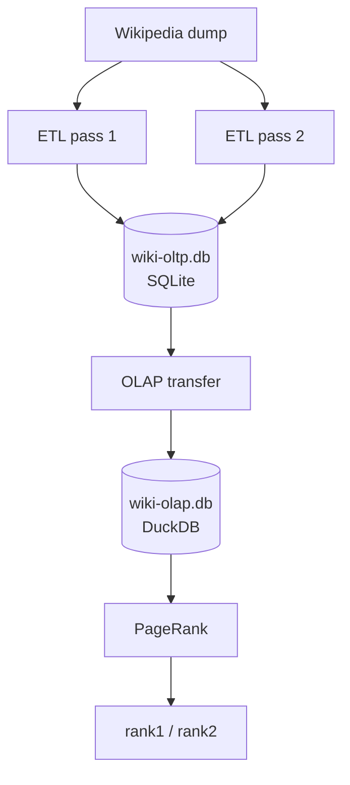

# WikiExperiments

## Overview

Wikipedia is one of the largest and most structured knowledge bases freely available. This project treats it as a playground for three interconnected experiments: large-scale ETL pipeline construction in Python, graph analysis via PageRank, and a direct performance comparison between SQLite and DuckDB for an iterative analytical workload.

The pipeline downloads a Wikipedia dump, extracts pages and links into a relational database, and computes PageRank entirely in SQL — first in SQLite, then in DuckDB — making the performance difference directly observable at scale.

## Background — PageRank & Wikipedia

PageRank was originally developed by Larry Page and Sergey Brin to rank web pages by importance. The core intuition is simple: a page is important if many important pages link to it. Importance propagates through the link graph iteratively until it converges.

Wikipedia is a natural fit for this analysis. Its internal links are human-curated, intentional, and topically meaningful — quite different from the commercial and algorithmic links that complicate web-scale PageRank. With millions of articles and hundreds of millions of links, it is also large enough to make computational choices matter.

The resulting ranks offer a data-driven measure of encyclopedic importance — distinct from page views or edit history — and surface which articles form the connective tissue of human knowledge.

## Architecture & Pipeline

The pipeline consists of two stages:



**1. ETL (`etl.py`)** — Parses a Wikipedia multistream dump in two passes. The index file locates compressed blocks in the data file, which are decompressed and parsed as XML using `mwparserfromhell`. Pass 1 loads all pages into SQLite; pass 2 loads internal links, external links, and redirects. Both passes run in parallel using `ProcessPoolExecutor`.

**2. PageRank (`pr.py`)** — Copies the SQLite tables into DuckDB for analytical processing, then computes PageRank iteratively in SQL. A ping-pong buffer alternates between two rank columns (`rank1`, `rank2`) to ensure all source ranks within a single iteration are consistent, and to avoid the overhead of creating and indexing a temporary table. Convergence is reached when the maximum rank delta falls below 1e-6. For comparison, PageRank can also be run directly against the SQLite database.

## Performance — SQLite vs DuckDB

One of the goals of this project is to compare SQLite and DuckDB as execution engines for an iterative analytical SQL workload. PageRank is a good benchmark: each iteration consists of several aggregation-heavy SQL statements over a large graph, repeated until convergence.

### Results — Simple English Wikipedia

| Stage | Time |
|-------|------|
| ETL pass 1 (pages) | 30s |
| ETL pass 2 (links) | 450s |
| PageRank — DuckDB (21 iterations) | 10s |
| PageRank — SQLite (21 iterations) | 510s |

| Database | Size |
|----------|------|
| SQLite (wiki-oltp.db) | ~425 MB |
| DuckDB (wiki-olap.db) | ~25 MB |

DuckDB computes 21 iterations in 10 seconds — roughly **50x faster** than SQLite for the same workload. Both engines converge in exactly 21 iterations with numerically equivalent results, confirming correctness.

The DuckDB database is also **20x smaller** than the SQLite equivalent, reflecting its columnar storage and compression.

### Results — Full English Wikipedia (estimated)

| Stage | Time |
|-------|------|
| ETL pass 2 (links) | ~8 hrs |
| PageRank — DuckDB | ~10 min |
| PageRank — SQLite | ~9 hrs |

The 50x DuckDB speedup makes the difference between a PageRank run that takes seconds and one that takes hours — a compelling case for columnar databases in iterative graph analytics.

## Getting Started

### Prerequisites

- Python 3.13 or higher
- [uv](https://docs.astral.sh/uv/) — Python package manager
- [Git](https://git-scm.com/)
- `wget` or `curl` for downloading dumps
- ~1 GB free disk space (Simple English Wikipedia)

### Installation

Clone the repository and install dependencies:

```bash
git clone https://github.com/idesis-gmbh/wikiexperiments.git
cd wikiexperiments
uv sync
```

`uv sync` reads `pyproject.toml` and installs all dependencies into a local virtual environment automatically.

### Data Download

Download the two Simple English Wikipedia dump files into the `data/` directory:

Using `wget`:
```bash
wget -P data/ https://dumps.wikimedia.org/simplewiki/latest/simplewiki-latest-pages-articles-multistream-index.txt.bz2
wget -P data/ https://dumps.wikimedia.org/simplewiki/latest/simplewiki-latest-pages-articles-multistream.xml.bz2
```

Using `curl`:
```bash
curl -o data/simplewiki-latest-pages-articles-multistream-index.txt.bz2 https://dumps.wikimedia.org/simplewiki/latest/simplewiki-latest-pages-articles-multistream-index.txt.bz2
curl -o data/simplewiki-latest-pages-articles-multistream.xml.bz2 https://dumps.wikimedia.org/simplewiki/latest/simplewiki-latest-pages-articles-multistream.xml.bz2
```

| File | Size |
|------|------|
| Index | ~5 MB |
| Data | ~375 MB |
| SQLite database (generated) | ~425 MB |

After downloading, update `config.py` to match the wiki name and date:

```python
WIKI_DATE = "latest"
WIKI_NAME = "simplewiki"
```

For full English Wikipedia, see [dumps.wikimedia.org/enwiki](https://dumps.wikimedia.org/enwiki) — be prepared for significantly larger processing times and disk requirements.

**Note:** The pipeline streams and decompresses the dump on the fly — the archive is never fully unpacked to disk. This is particularly significant for the full English Wikipedia, where the uncompressed XML would exceed 200 GB.

### Running the Pipeline

Run the full pipeline:

```bash
uv run main.py
```

This will:
1. Initialize the SQLite schema (skipped if database already exists)
2. ETL pass 1 — parse and load pages into SQLite
3. ETL pass 2 — parse and load links into SQLite
4. Transfer to DuckDB and compute PageRank

Or run each stage individually:

```bash
uv run etl.py    # ETL: parse dump and load into SQLite
uv run pr.py     # PageRank: transfer to DuckDB and compute ranks
```

To compare SQLite vs DuckDB PageRank performance, edit `pr.py` and call both:

```python
def run():
    run_page_rank_oltp()
    run_page_rank_olap()
```

Adjust `MAX_WORKERS` in `config.py` to match your CPU core count:

```python
MAX_WORKERS = 8  # default
```

Expected runtimes on Simple English Wikipedia:

| Stage | Time |
|-------|------|
| Schema initialisation | ~0.1s |
| ETL pass 1 (pages) | ~30s |
| ETL pass 2 (links) | ~450s |
| PageRank (DuckDB) | ~10s |

### Inspecting Results

Once the pipeline has run, explore the results with:

```bash
uv run explore.py
```

This will print:

- **Top 20 pages by PageRank** — the most important articles by link structure
- **Degree distribution** — histogram of in-degree and out-degree across all pages
- **Redirect statistics** — ratio of content pages to redirects
- **Shortest path** — fewest hops between "Mathematics" and "Adolf Hitler", a classic Wikipedia game challenge

To find the shortest path between two different articles, edit the last line of `explore.py`:

```python
shortest_path("Your source article", "Your target article")
```

## Project Structure

```
wikiexperiments/
├── main.py          # pipeline orchestrator
├── etl.py           # ETL: parse Wikipedia dump, load into SQLite
├── pr.py            # PageRank: transfer to DuckDB, compute ranks
├── explore.py       # inspect results: top pages, degree distribution, shortest path
├── config.py        # deployment settings (paths, wiki name, workers)
├── pyproject.toml   # project metadata and dependencies
├── uv.lock          # locked dependencies
├── .gitignore
├── README.md
├── sql/
│   ├── create_oltp_tables.sql   # SQLite schema
│   └── create_oltp_indices.sql  # SQLite indices
└── data/            # gitignored — local data only
    ├── .gitkeep
    ├── wiki-oltp.db             # SQLite database (generated)
    └── wiki-olap.db             # DuckDB database (generated)
```

## Future Work

**Richer content and metadata** — the current pipeline extracts page structure and links from the multistream dump. Two natural extensions are storing page text to enable full text search combined with PageRank ranking, forming a lightweight search engine; and processing Wikimedia's SQL exports which contain richer metadata — edit history, contributor activity, article quality ratings — opening the door to more nuanced analysis.

**Query interface** — a simple CLI or web interface for exploring results, for example listing the top N pages by rank or finding the most important pages linking to a given article.

## License

This project is licensed under the [MIT License](LICENSE)