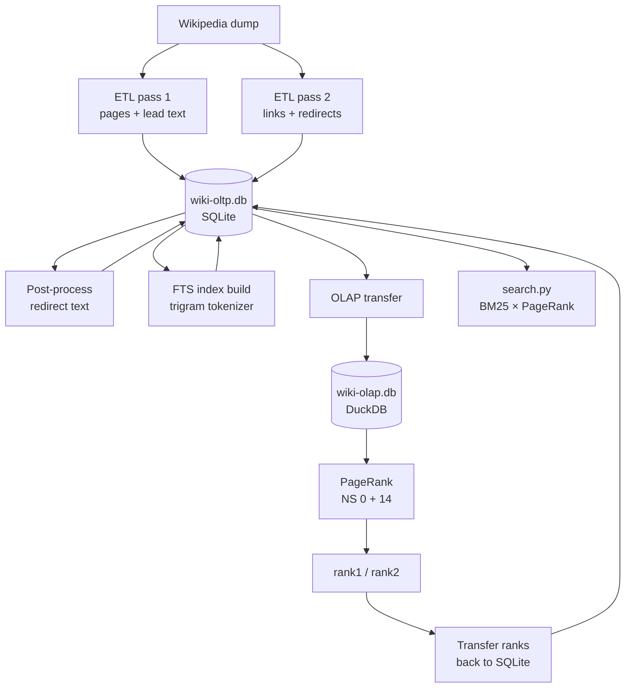

# WikiExperiments

## Overview

Wikipedia is one of the largest and most structured knowledge bases freely available. This project treats it as a playground for four interconnected experiments: large-scale ETL pipeline construction in Python, graph analysis via PageRank, a direct performance comparison between SQLite and DuckDB for an iterative analytical workload, and a search engine that combines full-text search with PageRank ranking.

The pipeline downloads a Wikipedia dump, extracts pages, links, and lead text into a relational database, builds a full-text search index, and computes PageRank entirely in SQL — first in SQLite, then in DuckDB — making the performance difference directly observable at scale. The resulting database supports both PageRank analysis and ranked full-text search queries.

## Blog Posts

- [What Does Wikipedia Really Know? PageRank, SQL, and a Surprising Beetle](docs/blog1/README.md)
- [Searching Wikipedia: BM25, PageRank, and the Limits of Both](docs/blog2/README.md)

## Background — PageRank & Wikipedia

PageRank was originally developed by Larry Page and Sergey Brin to rank web pages by importance. The core intuition is simple: a page is important if many important pages link to it. Importance propagates through the link graph iteratively until it converges.

Wikipedia is a natural fit for this analysis. Its internal links are human-curated, intentional, and topically meaningful — quite different from the commercial and algorithmic links that complicate web-scale PageRank. With millions of articles and hundreds of millions of links, it is also large enough to make computational choices matter.

The resulting ranks offer a data-driven measure of encyclopedic importance — distinct from page views or edit history — and surface which articles form the connective tissue of human knowledge. These ranks also serve as a relevance signal in the search engine: an article that ranks highly by PageRank is boosted in search results relative to articles that merely match the query text.

## Architecture & Pipeline

The pipeline consists of three stages:



**1. ETL (`etl.py`)** — Parses a Wikipedia multistream dump in two passes. The index file locates compressed blocks in the data file, which are decompressed and parsed as XML using `mwparserfromhell`. Pass 1 loads all pages into SQLite, storing lead paragraph text in a separate `internal_texts` table deduplicated by hash. Pass 2 loads internal links, external links, and redirects. Both passes run in parallel using `ProcessPoolExecutor`. A post-processing step propagates lead text from redirect targets back to redirect source pages, ensuring redirect pages are searchable. Finally, `update_schema()` builds two FTS5 virtual tables: `internal_texts_fts` over lead text content, and `internal_pages_fts` over page titles.

**2. PageRank (`pr.py`, `pr_nx.py`)** — `pr.py` copies the SQLite tables into DuckDB for analytical processing, then computes PageRank iteratively in SQL across both article pages (NS 0) and category pages (NS 14). A ping-pong buffer alternates between two rank columns (`rank1`, `rank2`) to ensure all source ranks within a single iteration are consistent. Results are written back to SQLite. For comparison, PageRank can also be run directly against the SQLite database. `pr_nx.py` provides a NetworkX alternative that loads the full graph into memory — competitive with DuckDB on smaller corpora but unsuitable for full English Wikipedia on typical hardware due to memory constraints.

**3. Search (`search.py`)** — Queries the SQLite database using two parallel FTS streams: one over page titles (`internal_pages_fts`) and one over lead text (`internal_texts_fts`). Before querying, each stream filters out high-frequency terms using IDF scores from the FTS vocabulary tables. The two result sets are merged and re-ranked by a normalised weighted combination of BM25 and PageRank. Redirects are resolved transparently so that a search for "Einstein" returns the Albert Einstein article even if the matching page is a redirect.

## Data Model

The SQLite database (`wiki-oltp.db`) contains the following tables:

```
internal_texts        — deduplicated lead paragraph texts
                        id, hash, text
                        (hash used for deduplication at insert time;
                         redirect pages sharing a target's lead text
                         reference the same row)

internal_pages        — article and category pages (NS 0, NS 14)
                        id, ns, title, text_id,
                        in_degree, out_degree, rank1, rank2

internal_links        — directed links between internal pages
                        source_id → target_id

redirects             — redirect mappings between internal pages
                        source_id → target_id

external_domains      — deduplicated external domains
                        id, name, tld

external_pages        — external URLs
                        id, url, domain_id

external_links        — links from internal pages to external URLs
                        source_id → target_id

internal_texts_fts    — FTS5 virtual table over internal_texts
                        (content table, backed by internal_texts,
                         trigram tokenizer — enables substring matching
                         at the cost of a larger index and slower build)

internal_pages_fts    — FTS5 virtual table over internal_pages titles
                        (content table, backed by internal_pages,
                         trigram tokenizer — enables substring matching
                         at the cost of a larger index and slower build)
```

Separating lead texts into `internal_texts` keeps `internal_pages` narrow. Since PageRank iterates over `internal_pages` repeatedly but never touches text, this has a measurable effect on SQLite performance: removing the wide `text` column from `internal_pages` reduced SQLite PageRank runtime by roughly 6x, from ~4150s to ~705s, even though the PageRank queries themselves are unchanged. DuckDB is unaffected because it already excluded the text column during the OLAP transfer.

The trigram tokenizer is used by default because it produces meaningfully better search quality than the unicode61 tokenizer — it enables substring matching and improves nDCG@10 noticeably on the SemSearch_ES benchmark. The trade-off is a substantially larger FTS index and a slower build: on Simple English Wikipedia the FTS build takes ~200s with trigram vs ~18s with unicode61, and on full English Wikipedia it takes ~2 hours. Users who do not need search can skip the FTS build entirely; users who prioritise index size over search quality can switch to `unicode61 remove_diacritics 2` in `create_fts_tables.sql`.

The external link tables capture the full outbound link graph of Wikipedia. As an example of what this enables: roughly 20% of all external links in Simple English Wikipedia point to the Wayback Machine (web.archive.org), making external domain analysis a natural candidate for future trust and source quality work.

## Performance — PageRank Engine Comparison

One of the goals of this project is to compare different execution engines for an iterative analytical workload. PageRank is a good benchmark: each iteration consists of several aggregation-heavy operations over a large graph, repeated until convergence. Three engines are supported: NetworkX (in-memory Python graph library), SQLite, and DuckDB.

### Results — Simple English Wikipedia

| Stage | Time |
|-------|------|
| ETL pass 1 (pages + lead text) | ~210s |
| ETL pass 2 (links) | ~420s |
| Post-process (redirects) | ~3s |
| FTS index build | ~210s |
| PageRank — NetworkX (28 iterations) | ~24s |
| PageRank — DuckDB (28 iterations) | ~24s |
| PageRank — SQLite (28 iterations) | ~720s |

| Database | Size |
|----------|------|
| Wikipedia Archive | ~400 MB |
| SQLite (simplewiki-oltp.db) | ~1.2 GB |
| DuckDB (simplewiki-olap.db) | ~100 MB |

On Simple English Wikipedia all three engines converge in exactly 28 iterations with numerically equivalent results. NetworkX and DuckDB are comparable in runtime (~24s each); SQLite is roughly **30x slower** due to its row-oriented storage and the overhead of repeated aggregations over large tables.

The DuckDB database is also **12x smaller** than the SQLite equivalent. The OLAP transfer excludes the `text_id` column and the `internal_texts` table entirely since PageRank does not use them, keeping the DuckDB database compact and the transfer fast.

The key difference between NetworkX and DuckDB becomes apparent at scale: NetworkX loads the entire graph into memory as Python objects, so memory consumption scales directly with graph size. DuckDB operates out of core via its buffer pool, processing data that exceeds available RAM. On Simple English Wikipedia both approaches fit comfortably in memory; on full English Wikipedia NetworkX requires more RAM than is available on typical hardware.

### Results — Full English Wikipedia

| Stage | Time |
|-------|------|
| ETL pass 1 (pages + lead text) | ~4 hrs |
| ETL pass 2 (links) | ~7 hrs |
| Post-process (redirects) | ~10 min |
| FTS index build | ~2 hrs |
| PageRank — DuckDB | ~31 min |
| PageRank — NetworkX | exceeds RAM |
| Results transfer | ~4 min |

| Database | Size |
|----------|------|
| Wikipedia Archive | ~25 GB |
| SQLite (enwiki-oltp.db) | ~90 GB |
| DuckDB (enwiki-olap.db) | ~6 GB |

The total pipeline run from scratch takes roughly 14 hours. The 90 GB SQLite figure reflects the trigram FTS index; switching to unicode61 would produce a considerably smaller database. DuckDB's out-of-core execution makes it the only practical engine for PageRank at this scale on typical hardware.

## Getting Started

### Prerequisites

- Python 3.13 or higher
- [uv](https://docs.astral.sh/uv/) — Python package manager
- [Git](https://git-scm.com/)
- `wget` or `curl` for downloading dumps
- ~2 GB free disk space (Simple English Wikipedia)
- ~100 GB free disk space (full English Wikipedia)

### Installation

Clone the repository and install dependencies:
```bash
git clone https://github.com/idesis-gmbh/wikiexperiments.git
cd wikiexperiments
uv sync
```

`uv sync` reads `pyproject.toml` and installs all dependencies into a local virtual environment automatically.

### Data Download

Download the two Simple English Wikipedia dump files into the `data/` directory:

Using `wget`:
```bash
wget -P data/ https://dumps.wikimedia.org/simplewiki/latest/simplewiki-latest-pages-articles-multistream-index.txt.bz2
wget -P data/ https://dumps.wikimedia.org/simplewiki/latest/simplewiki-latest-pages-articles-multistream.xml.bz2
```

Using `curl`:
```bash
curl -o data/simplewiki-latest-pages-articles-multistream-index.txt.bz2 https://dumps.wikimedia.org/simplewiki/latest/simplewiki-latest-pages-articles-multistream-index.txt.bz2
curl -o data/simplewiki-latest-pages-articles-multistream.xml.bz2 https://dumps.wikimedia.org/simplewiki/latest/simplewiki-latest-pages-articles-multistream.xml.bz2
```

| File | Size |
|------|------|
| Index | ~5 MB |
| Data | ~375 MB |
| SQLite database (generated) | ~1.2 GB |
| DuckDB database (generated) | ~100 MB |

After downloading, update `config.py` to match the wiki name and date:

```python
WIKI_DATE = "latest"
WIKI_NAME = "simplewiki"
```

For full English Wikipedia, see [dumps.wikimedia.org/enwiki](https://dumps.wikimedia.org/enwiki). The compressed dump is approximately 25 GB; be prepared for significantly larger processing times and disk requirements (~100 GB).

**Note:** The pipeline streams and decompresses the dump on the fly — the archive is never fully unpacked to disk. This is particularly significant for the full English Wikipedia, where the uncompressed XML would exceed 200 GB.

### Running the Pipeline

Run the full pipeline:

```bash
uv run main.py
```

This will:
1. Initialize the SQLite schema (skipped if database already exists)
2. ETL pass 1 — parse and load pages and lead text into SQLite
3. ETL pass 2 — parse and load links and redirects into SQLite
4. Post-process — propagate lead text through redirect chains
5. Build FTS index — create `internal_pages_fts` (titles) and `internal_texts_fts` (lead text) virtual tables
6. Transfer to DuckDB and compute PageRank
7. Transfer PageRank results back to SQLite

Or run each stage individually:

```bash
uv run etl.py    # ETL: parse dump, load into SQLite, build FTS index
uv run pr.py     # PageRank: transfer to DuckDB, compute ranks, write back
```

To compare SQLite vs DuckDB PageRank performance, edit `pr.py` and call both:

```python
def run():
    run_page_rank_oltp([0, 14])
    run_page_rank_olap([0, 14])
```

Adjust `MAX_WORKERS` in `config.py` to match your CPU core count:

```python
MAX_WORKERS = 8  # default
```

See the [Performance](#performance--pagerank-engine-comparison) section for expected runtimes on both Simple and full English Wikipedia.

### Searching

Once the pipeline has run, search the database with:

```bash
uv run search.py "your query"
```

Results are printed to stdout and include the page title, BM25 score, PageRank, and lead text. An optional second argument redirects output to a log file:

```bash
uv run search.py "your query" logs/query.log
```

The search engine runs two parallel FTS streams — one over page titles, one over lead text — each with IDF-based stopword filtering to suppress high-frequency terms before querying. The two result sets are merged and re-ranked by a normalised weighted combination of BM25 and PageRank, with redirect resolution applied transparently.

The focus is on keyword search rather than semantic similarity: queries are matched against indexed terms directly, without embeddings or query expansion. This makes the system fast and interpretable, and well suited to the kind of entity-oriented queries (names, concepts, proper nouns) that dominate Wikipedia navigation. On full English Wikipedia, mean nDCG@10 is 0.455 against the SemSearch_ES queries from DBpedia-Entity v2 [Hasibi et al., SIGIR 2017](https://github.com/iai-group/DBpedia-Entity) — a keyword-oriented entity retrieval benchmark.

### Inspecting Results

Once the pipeline has run, explore the database with:

```bash
uv run explore.py
```

This will print:

- **Top 20 pages by PageRank** — the most important articles by link structure
- **Degree distribution** — histogram of in-degree and out-degree across all pages
- **Redirect statistics** — ratio of content pages to redirects
- **Shortest path** — fewest hops between "Mathematics" and "Adolf Hitler", a classic Wikipedia game challenge

To find the shortest path between two different articles, edit the last line of `explore.py`:

```python
shortest_path("Your source article", "Your target article")
```

## Project Structure

```
wikiexperiments/
├── main.py          # pipeline orchestrator
├── etl.py           # ETL: parse Wikipedia dump, load into SQLite, build FTS index
├── pr.py            # PageRank: transfer to DuckDB, compute ranks, write back
├── pr_nx.py         # PageRank: NetworkX alternative (in-memory, simplewiki only)
├── db.py            # database connections: SQLite and DuckDB context managers
├── search.py        # search: two-stream BM25 × PageRank ranked full-text search
├── ndcg.py          # evaluation: nDCG@10 against DBpedia-Entity v2 SemSearch_ES
├── explore.py       # inspect results: top pages, degree distribution, shortest path
├── config.py        # deployment settings (paths, wiki name, workers)
├── pyproject.toml   # project metadata and dependencies
├── uv.lock          # locked dependencies
├── .gitignore
├── README.md
├── sql/
│   ├── create_oltp_tables.sql   # SQLite schema
│   ├── create_oltp_indices.sql  # SQLite indices
│   └── create_fts_tables.sql    # FTS5 virtual tables (titles + texts) and triggers
├── logs/            # gitignored — evaluation output
│   └── .gitkeep
├── docs/
│   ├── blog1/
│   │   └── README.md    # Blog post 1 (English)
│   └── blog2/
│       └── README.md    # Blog post 2 (English)
└── data/            # gitignored — local data only
    ├── .gitkeep
    ├── wiki-oltp.db             # SQLite database (generated)
    ├── wiki-olap.db             # DuckDB database (generated)
    └── DBpedia-Entity/          # clone of iai-group/DBpedia-Entity (evaluation)
```

## Future Work

**External link trust and source quality** — the ETL pipeline captures the full external link graph, including domain and TLD information via `tldextract`. Initial analysis shows that a substantial fraction of all external links point to archival sources (e.g. the Wayback Machine). A systematic analysis of the external link graph could yield a network of source trust or citation quality, complementing the internal PageRank signal.

**Query interface** — a CLI or web interface for exploring results interactively. A web interface in particular would require document lookup (rendering full article text beyond the lead paragraph) and Wikitext template expansion, which are prerequisites for displaying complete article content.

**Richer metadata** — the current pipeline extracts page structure, links, and lead text from the multistream dump. Processing Wikimedia's SQL exports would add richer metadata — edit history, contributor activity, article quality ratings — opening the door to more nuanced analysis beyond link-graph importance.

## License

This project is licensed under the [MIT License](LICENSE)